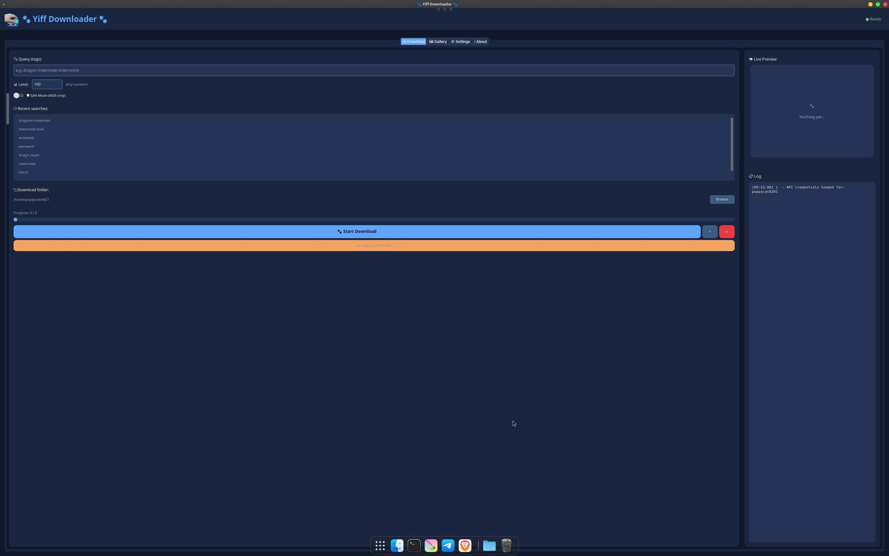
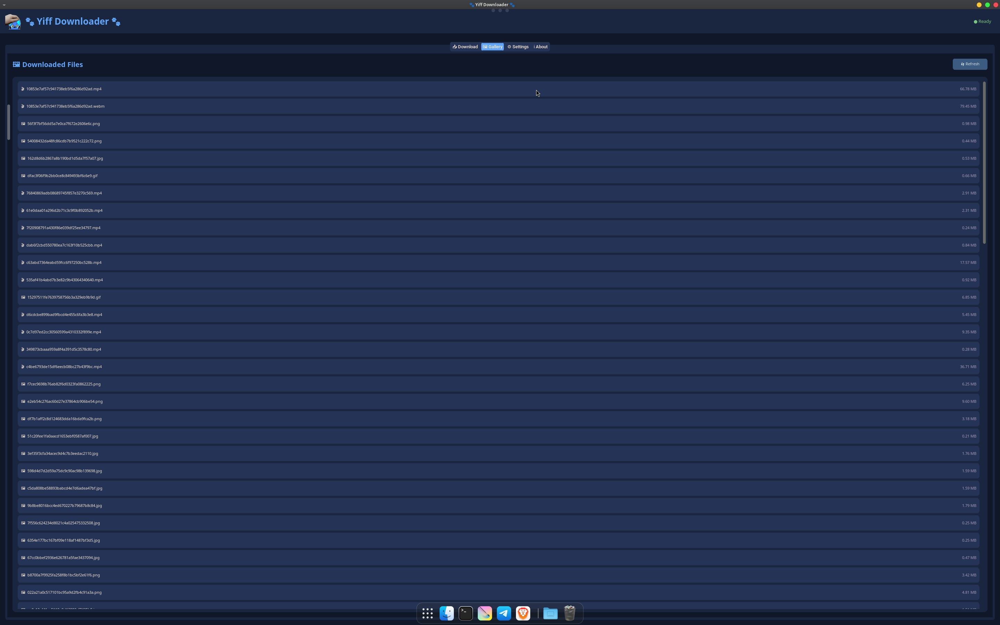
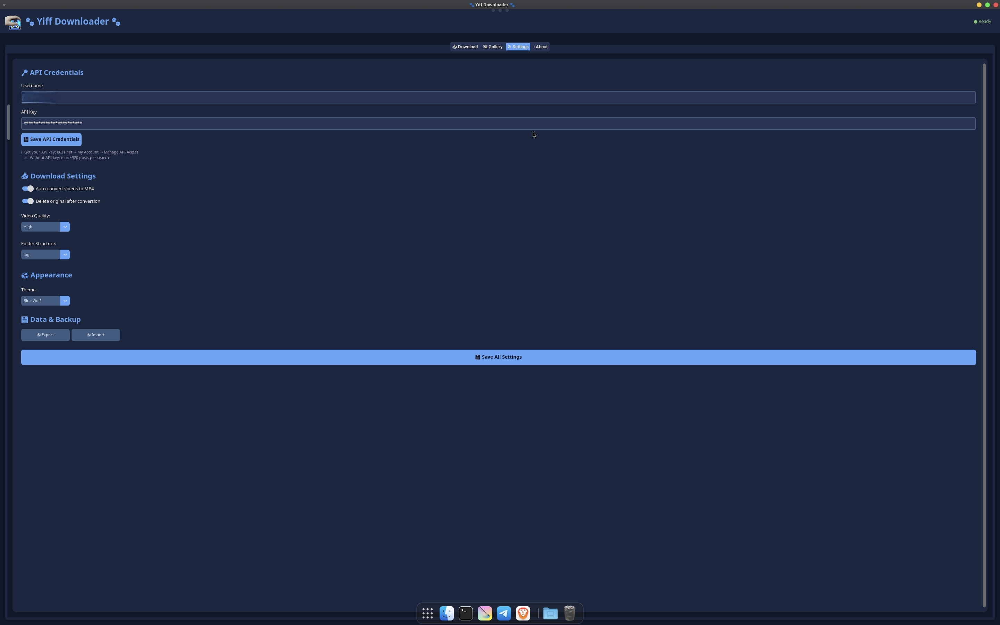
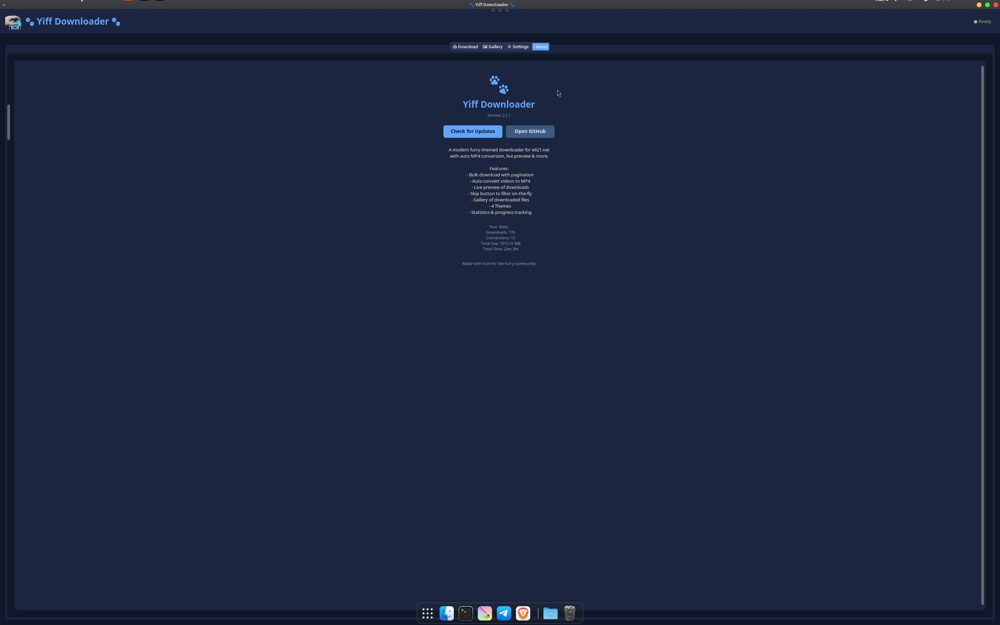

<div align="center">

# 🐾 Yiff Downloader

**A modern, lightweight media downloader for e926.net / e621.net with automatic MP4 conversion.**

[](https://www.python.org/)
[]()
[](LICENSE)
[]()

[Features](#-features) • [Installation](#-installation) • [Usage](#-usage) • [Search Tips](#-search-tips) • [FAQ](#-faq)

</div>

---

## 📖 About

**Yiff Downloader** is a lightweight desktop application for downloading media from **e926.net** (the safe-for-work version) and **e621.net**. It features a modern dark UI, automatic video conversion, live previews, and much more — all in a single Python script.

Built with **CustomTkinter** for a sleek interface and **FFmpeg** for fast, reliable video conversion.

---

## ✨ Features

| Feature | Description |
|---------|-------------|
| 📥 **Bulk Download** | Download many posts at once with automatic pagination |
| 🎬 **Auto MP4 Conversion** | Every video/gif becomes `.mp4` automatically |
| 👁️ **Live Preview** | See each download as an animated preview in real-time |
| ⏭️ **Skip Button** | Don't like what you see? Skip it instantly |
| 🖼️ **Gallery** | Browse all your downloaded files inside the app |
| 🕘 **Search History** | Quickly re-use your last 20 searches |
| 🎨 **4 Themes** | Furry Orange, Purple Paws, Blue Wolf, Green Fox |
| 📊 **Progress Bar** | Track downloads in real-time |
| ⚙️ **Quality Control** | Low / Medium / High / Ultra |
| 📁 **Folder Structure** | Organize by artist, pool, or tag |
| ⏸️ **Pause/Resume** | Pause and resume anytime |
| 🛡️ **Safe Mode** | Default mode uses e926.net (SFW) |
| 📈 **Statistics** | Track downloads, conversions, size, and time |
| 💾 **Export/Import** | Backup and restore all settings |

---

## 📸 Screenshots

### 📥 Download Tab


### 🖼️ Gallery


### ⚙️ Settings


### ℹ️ About



## 🎬 Mwahahaha! 😈


## 🚀 Installation

### ⚡ Quick Install (One Command)

```bash
# 1. Clone the repository
git clone https://github.com/puppycat291/yiff-downloader.git
cd yiff-downloader

# 2. Run the automatic installer
bash install_yiff.sh
```

**That's it!** The installer will:
- ✅ Install all system dependencies
- ✅ Create a virtual environment
- ✅ Install Python packages
- ✅ Generate the app icon 🐾
- ✅ Create desktop shortcuts
- ✅ Launch the app automatically

After install, you'll find **🐾 Yiff Downloader** in:
- Your **Desktop** (as an icon)
- Your **Applications menu**

### 📋 Manual Installation

<details>
<summary>Click to expand manual steps</summary>

```bash
# 1. Install system packages
sudo apt update
sudo apt install -y python3 python3-venv python3-tk ffmpeg

# 2. Clone the repository
git clone https://github.com/puppycat291/yiff-downloader.git
cd yiff-downloader

# 3. Create virtual environment
python3 -m venv .venv
source .venv/bin/activate

# 4. Install Python dependencies
pip install customtkinter pillow requests

# 5. Run the app
python3 yiff_downloader.py
```

</details>

---

## 🎮 Usage

### First Launch

1. **Launch the app** from your desktop or application menu.
2. The app **defaults to Safe Mode** (e926.net).
3. For advanced features, go to **⚙️ Settings** and enter your e621 username + API key.

> ⚠️ **Without an API key**, you can only download up to **320 posts per search**.

### Getting Your API Key

1. Log in to [e621.net](https://e621.net).
2. Go to **My Account** → **Manage API Access**.
3. Enter your password to confirm.
4. **Copy** your API key (keep it private!).
5. Paste it into the app's Settings tab.

### Downloading Content

1. Go to the **📥 Download** tab.
2. Enter your search tags, e.g.:
   ```
   wolf male solo
   ```
3. Set the **Limit** (any number).
4. Click **🐾 Start Download**.
5. Watch the live preview as files download and convert automatically.

### Controls

| Button | Action |
|--------|--------|
| 🐾 **Start Download** | Begin downloading |
| ⏸️ **Pause** | Pause / resume |
| ⏹️ **Stop** | Stop the entire download |
| ⏭️ **Skip Current File** | Delete current, move to next |

---

## 🔎 Search Tips

The app supports **e621's full tag syntax**. Here are some useful examples:

### Order (Sorting)

| Tag | Effect |
|-----|--------|
| `order:score` | Highest rated first |
| `order:rank` | Trending / popular now |
| `order:random` | Random order |
| `order:id` | Newest first (default) |
| `order:favcount` | Most favorited |

### Content Rating

| Tag | Effect |
|-----|--------|
| `rating:safe` | Safe content only (SFW) |
| `rating:questionable` | Questionable content |
| `rating:explicit` | Explicit content |

### File Type

| Tag | Effect |
|-----|--------|
| `type:webm` | Videos only |
| `type:mp4` | MP4 videos only |
| `type:gif` | Animated GIFs only |
| `type:jpg` | JPG images |
| `type:png` | PNG images |
| `type:swf` | Flash files |

### Filtering

| Tag | Effect |
|-----|--------|
| `artist:name` | Posts by a specific artist |
| `score:>100` | Score above 100 |
| `score:<10` | Score below 10 |
| `favcount:>50` | 50+ favorites |
| `-tag` | **Exclude** a tag (e.g., `-human`) |
| `~tag1 ~tag2` | Either tag (OR logic) |
| `tag1 tag2` | Both tags (AND logic) |

### Combining Tags

You can combine as many tags as you want:

```
wolf male/male order:score rating:safe type:webm
```

This searches for:
- **wolf** AND **male/male** content
- **sorted by score** (highest first)
- **safe rating only**
- **videos only (webm)**

### Practical Examples

| Goal | Query |
|------|-------|
| Trending furry art | `furry order:rank` |
| Best dragon art | `dragon order:score score:>200` |
| Random wolf videos | `wolf type:webm order:random` |
| SFW fox images | `fox rating:safe type:jpg` |
| Specific artist | `artist:some_name order:score` |

> 💡 **Pro Tip**: Combine `order:random` with a specific tag to discover new content you might not have seen before!

---

## ⚙️ Settings Overview

| Setting | Description |
|---------|-------------|
| **Username** | Your e621 username |
| **API Key** | Your e621 API key (kept private) |
| **Safe Mode** | Default ON — uses e926.net only |
| **Auto-convert** | Convert videos to MP4 automatically |
| **Delete Original** | Delete source files after conversion |
| **Video Quality** | Low / Medium / High / Ultra |
| **Folder Structure** | `none` / `artist` / `pool` / `tag` |
| **Theme** | 4 built-in themes |

---

## 📂 File Locations

| Path | Purpose |
|------|---------|
| `~/YiffDownloader/` | Application folder |
| `~/YiffDownloads/` | Default download folder |
| `~/.config/yiff_downloader/` | Settings & stats |
| `~/.local/share/applications/yiff-downloader.desktop` | Desktop entry |

---

## ❓ FAQ

<details>
<summary><strong>❌ "No posts found" or "403 Forbidden"</strong></summary>

This means the server rejected your request. Common causes:
- **Wrong API key** — double-check in Settings.
- **Typo in tags** — verify your search tags.
- **Rate limiting** — wait a few minutes and try again.
</details>

<details>
<summary><strong>❌ Videos aren't converting to MP4</strong></summary>

Make sure **FFmpeg** is installed:
```bash
sudo apt install ffmpeg
```

Verify it's detected:
```bash
which ffmpeg
# Should print: /usr/bin/ffmpeg
```
</details>

<details>
<summary><strong>❌ App doesn't launch from desktop icon</strong></summary>

Right-click the desktop file and choose **"Allow Launching"**.

Or from terminal:
```bash
gio set ~/Desktop/"Yiff Downloader.desktop" metadata::trusted true
```
</details>

<details>
<summary><strong>❓ Can I use this without an API key?</strong></summary>

Yes, but with limitations:
- Maximum **320 posts per search**.
- Some tags may be restricted.

**Get an API key** to unlock unlimited downloads.
</details>

<details>
<summary><strong>❓ What does "order:rank" mean?</strong></summary>

`order:rank` sorts results by **popularity / trending**. It's what you see on the e621 homepage "Hot" tab. Use it to find content that the community is currently enjoying.
</details>

---

## 🛠️ Troubleshooting

### Reset All Settings

```bash
rm -rf ~/.config/yiff_downloader/
```

### Check ffmpeg

```bash
ffmpeg -version | head -1
```

---

## 🤝 Contributing

Contributions are welcome! 🐾

1. Fork this repository
2. Create a feature branch: `git checkout -b feature/my-feature`
3. Commit changes: `git commit -am 'Add new feature'`
4. Push: `git push origin feature/my-feature`
5. Open a Pull Request

---

## 📄 License

This project is licensed under the **MIT License** — see the [LICENSE](LICENSE) file for details.

---

## ⚠️ Disclaimer

This tool is for **personal, lawful use only**. Please respect:
- [e621.net Terms of Service](https://e621.net/terms_of_service)
- [e926.net Terms of Service](https://e926.net/terms_of_service)
- Content creators' rights
- Rate limits

By default, the application runs in **Safe Mode** using e926.net. Users are responsible for ensuring their usage complies with applicable laws and regulations.

---

<div align="center">

**Made with ❤️ for the furry community 🐾**

⭐ If you enjoy this project, please give it a star!

</div>
